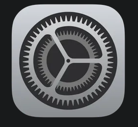
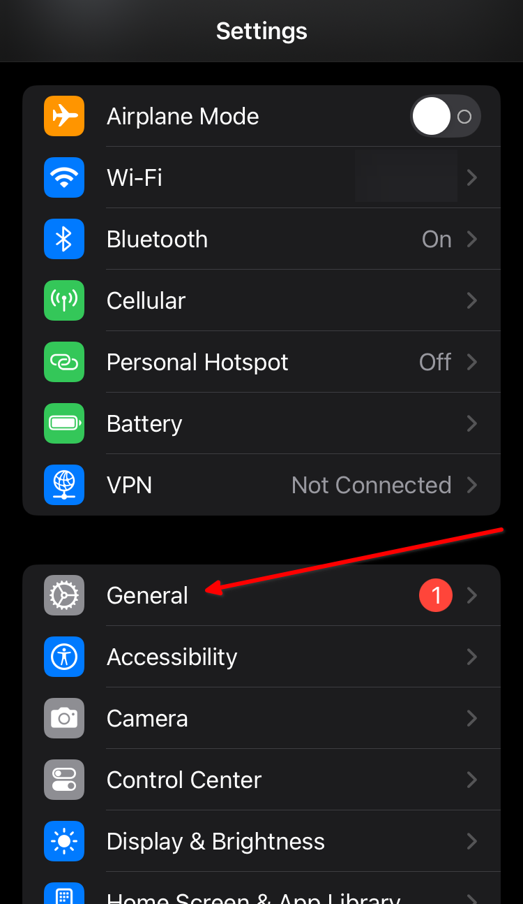
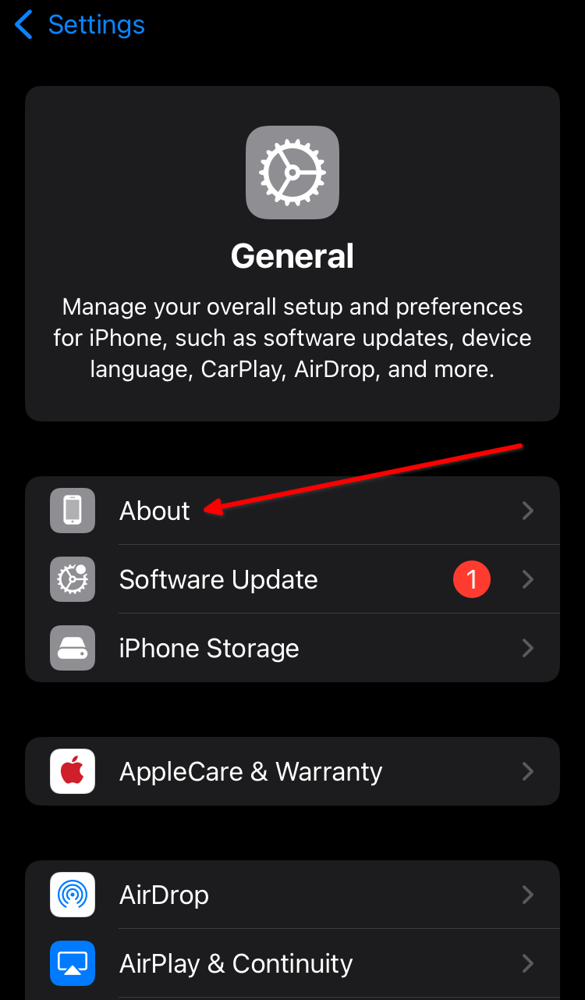
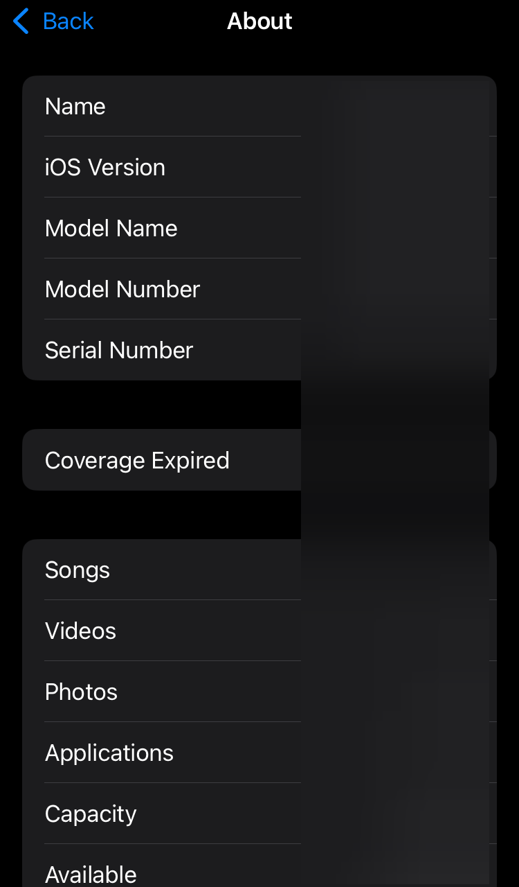

# iPhone
## How to find your phone's model and serial number (and other info)
**Tap the _Settings_ icon**

{: width=100 }

---

**Tap _General_**

{: width=375 }

---

**Tap _About_**

{: width=375 }

---

**Phone Information Screen**

You should see information about your phone listed like:

- Model Name
- Model Number
- Serial Number
- etc.

{: width=375 }
